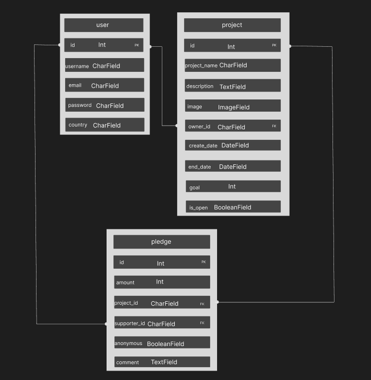
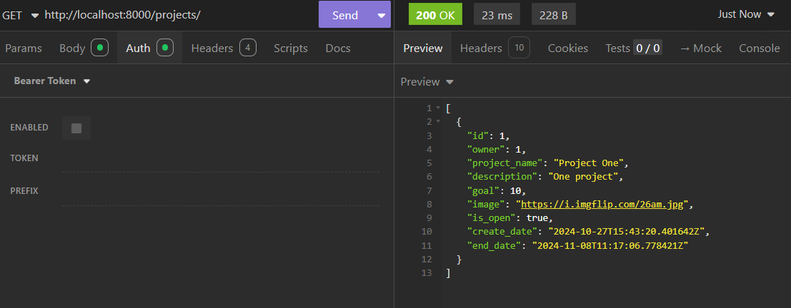
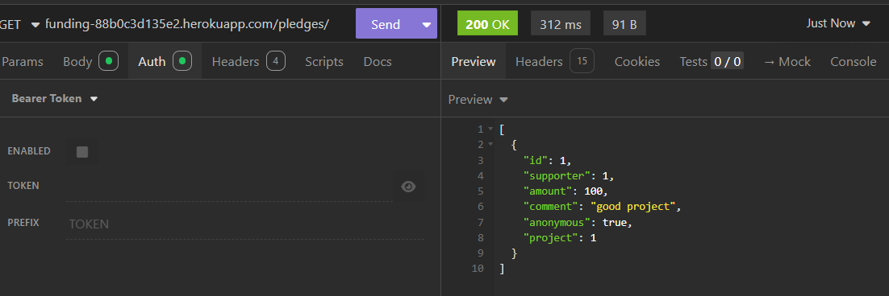
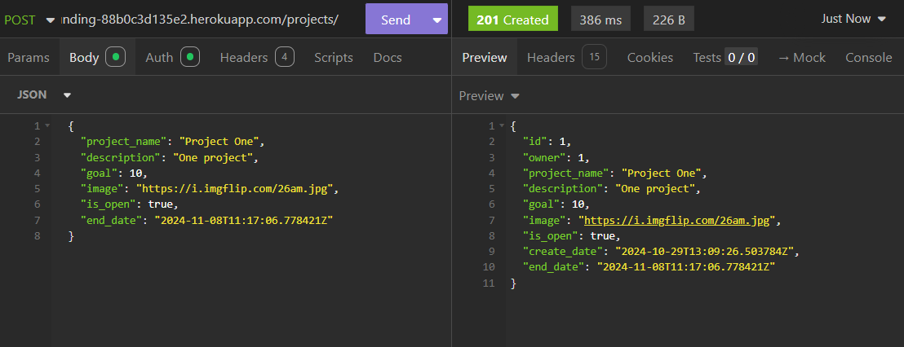
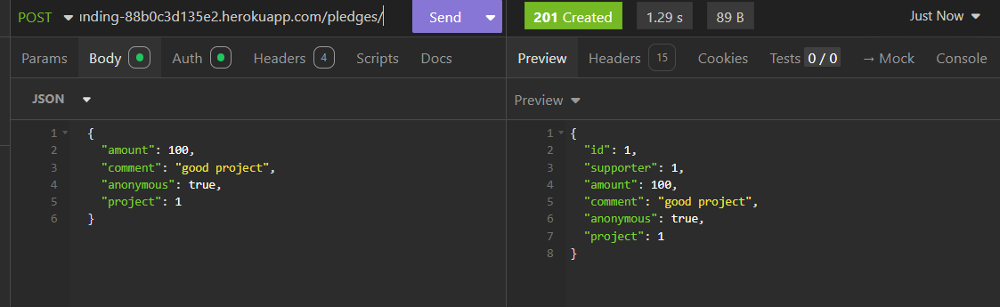
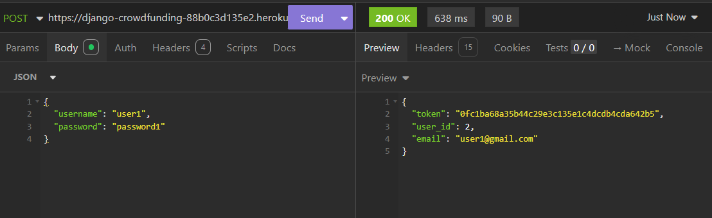
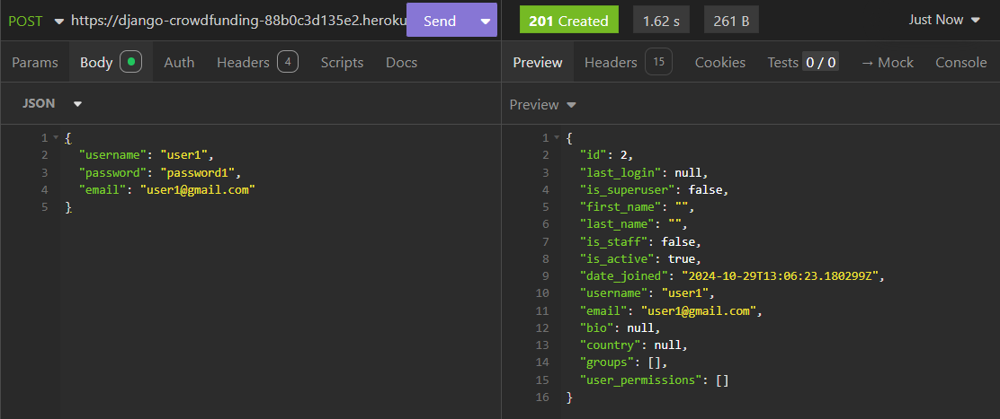
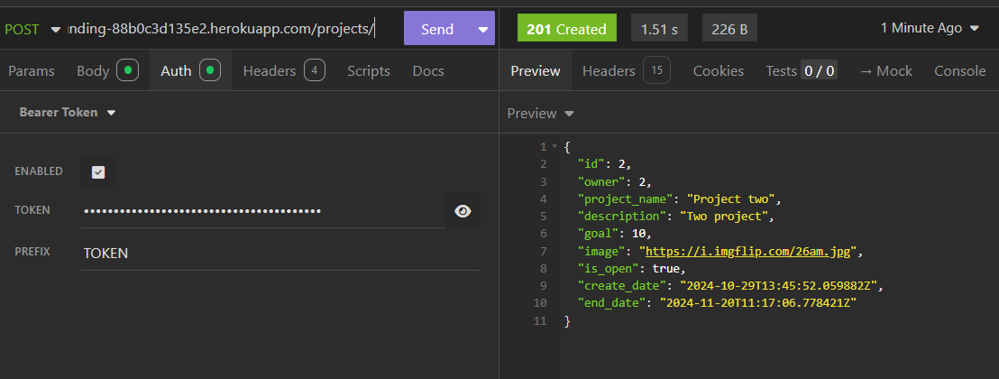
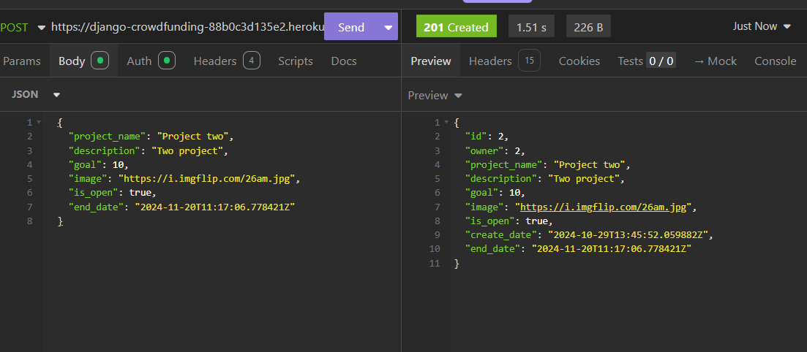

# Django_crowdfunding_backend
## API Plan

# Crowdfunding Back End
Rishika

## Planning:
### Concept/Name
My website (UplistU) help entrepreneur to collect funds to work on their innovative project.

### Intended Audience/User Stories
Anyone who supports the particular innovative idea will become a shareholder of that project. 

### Front End Pages/Functionality
- {{ A page on the front end }}
    - {{ A list of dot-points showing functionality is available on this page }}
    - {{ etc }}
    - {{ etc }}
- {{ A second page available on the front end }}
    - {{ Another list of dot-points showing functionality }}
    - {{ etc }}

### API Spec

| URL         | HTTP Method | Purpose                            | Request Body   | Success Response Code | Authentication/Authorisation                            |
| :---------- | :---------- | :--------------------------------- | :------------- | :-------------------- | :------------------------------------------------------ |
| /projects   | GET         | Returns all projects               | N/A            | 200                   | N/A                                                     |
| /projects/  | POST        | Create a new project               | Project object | 201                   | Must be logged in                                       |
| /projects1/ | GET         | Returns the project with ID of "1" | N/A            | 200                   | N/A                                                     | 200 | N/A |
| /project1/  | PUT         | Updates the project with ID of "1" | Project object | 200                   | Must be logged in, Must be the project owner            |
| /pledges/   | POST        | Create a new pledge                | Pledge object  | 201                   | Must be logged in, Must not be the owner of the project |
| pledges/1/  | GET         | Get the pledge with ID of "1"      | N/A            | 200                   | N/A                                                     |
| pledges/1/  | DELETE      | Deletes the pledge with ID of "1"  | N/A            | 200                   | Must be logged in, Must be the pledge owner.            |

### DB Schema
ERD Diagram:  

- A link to the deployed project:

 https://django-crowdfunding-88b0c3d135e2.herokuapp.com/

- GET method:
 
 

-POST method:

- Token being returned:

- Register a new user:

